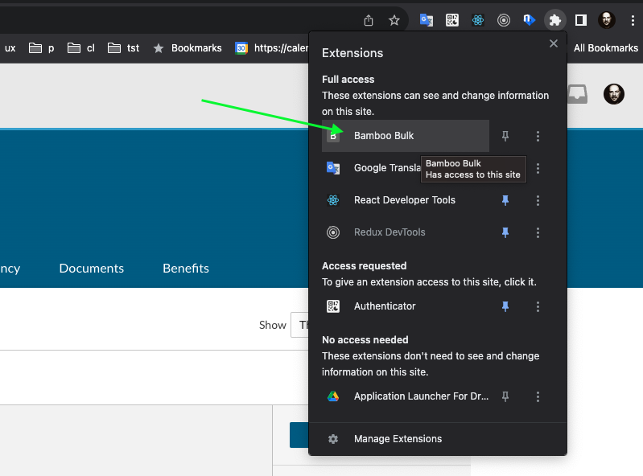

# BambooBulk Clock Entries

Adds your working hours all at once for all days in your current BambooHR pay period.

### How do I get set up?  

1) Clone or Download repository. Ready to use Chrome extension in `extension` folder.

2) In Chrome browser open `Manage Extensions`

3) Enable Developer mode

4) Press `Load Unpacked` and select `extension` folder

5) You should see `Bamboo Bulk` extension installed. Enable it if it is not enabled.

6) Open your BambooHR timesheet page, you should see the Button `Bulk Time Entries` injected by extension.

7) By default we have two time entries `09AM - 01PM` and `02PM - 06PM`. 
Press button if you're Ok with default entries or follow the next steps to specify your custom time entries.

### How to specify custom time entries? 

1) Press on Bamboo Bulk extension

2) Select you custom time values

3) Go back to your BambooHR timesheet page, and press `Bulk Time Entries` button to start the process

### Bulk Time Entries skips (time entries not posted):

1) Weekends - Saturday and Sunday, the time entries are written only on your working days Monday - Friday.
2) Official Holidays displayed in your timesheet.
3) Vacation days.
4) The days with already written time entries.

> Only your active `Pay period timesheet` is affected.

### TODO

1) Ability to add and delete custom time entries
2) Ability to specify days of week for custom time entries