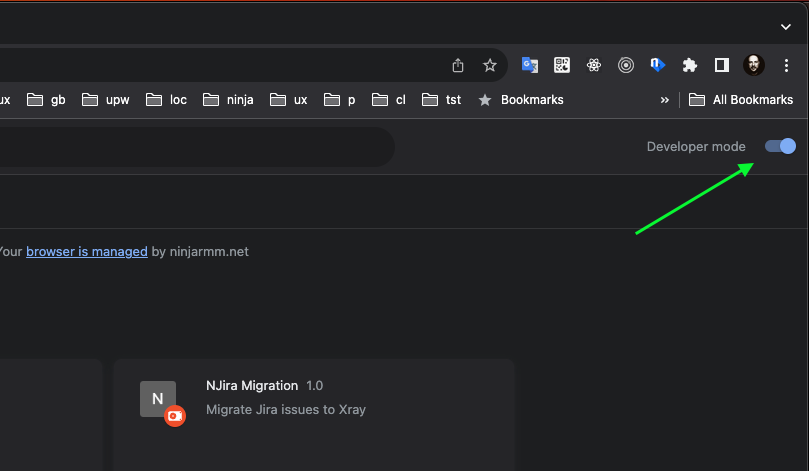

# BambooBulk Clock Entries

Adds your working hours all at once for all days in your current BambooHR pay period/timesheet or previous pending timesheet. Quick add/delete clock entries for one day.  
Active extension in `chrome web store` [Bamboo Bulk v1.5.0](https://chromewebstore.google.com/detail/bamboo-bulk/eamnacflhenaamlhfammimplkgjhfdci)
<!-- TOC -->
* Installation and get started
    * [Install extension from Chrome web store](#install-from-chrome-web-store)
    * [Quick get started](#quick-get-started)
    * [Pre-default config notes](#predefault-config-notes)
    * [Install from the source](#install-extension-from-the-source)
<!-- TOC -->

### Install extension from Chrome web store
- Goto [Bamboo Bulk v1.3.0](https://chromewebstore.google.com/detail/bamboo-bulk/eamnacflhenaamlhfammimplkgjhfdci) and install extension

### Quick get started
1) Press on Bamboo Bulk extension popup    
   
2) Select you custom time values or leave it as is.   
   
3) Go to your BambooHR timesheet page, and press `Bulk Time Entries` button to start the process    
   

  
### Pre-default config notes
- Bamboo Bulk skips the days with already written time entries.
- By default, it skips, but can be overridden in configs:
1) `Skip Weekends` - Saturday and Sunday, the time entries are written only on your working days Monday - Friday.
2) `Skip Holidays` - Official Holidays displayed in your timesheet.
3) `Skip Time Offs` - Vacation days and other time offs.

> Only your active `Pay period timesheet` is affected.

### Install extension from the source 

1) Clone or Download repository. Ready to use Chrome extension in `extension` folder.
Also you can dowload `extension.zip` in `Releases`.

2) In Chrome browser open `Manage Extensions`  

3) Enable Developer mode  

4) Press `Load Unpacked` and select `extension` folder  

5) You should see `Bamboo Bulk` extension installed. Enable it if it is not enabled.  

6) Open your BambooHR timesheet page, you should see additional elements injected by extension:    
- the Button `Bulk Time Entries` - populates all days of payed period with time entries all at once
- delete ❌ icon - deletes clock entries for one day
- add 🕔 icon - adds clock entries for one day  
  
7) By default we have two time entries `09AM - 01PM` and `02PM - 06PM`. 
Press `Bulk Time Entries` button to start.

